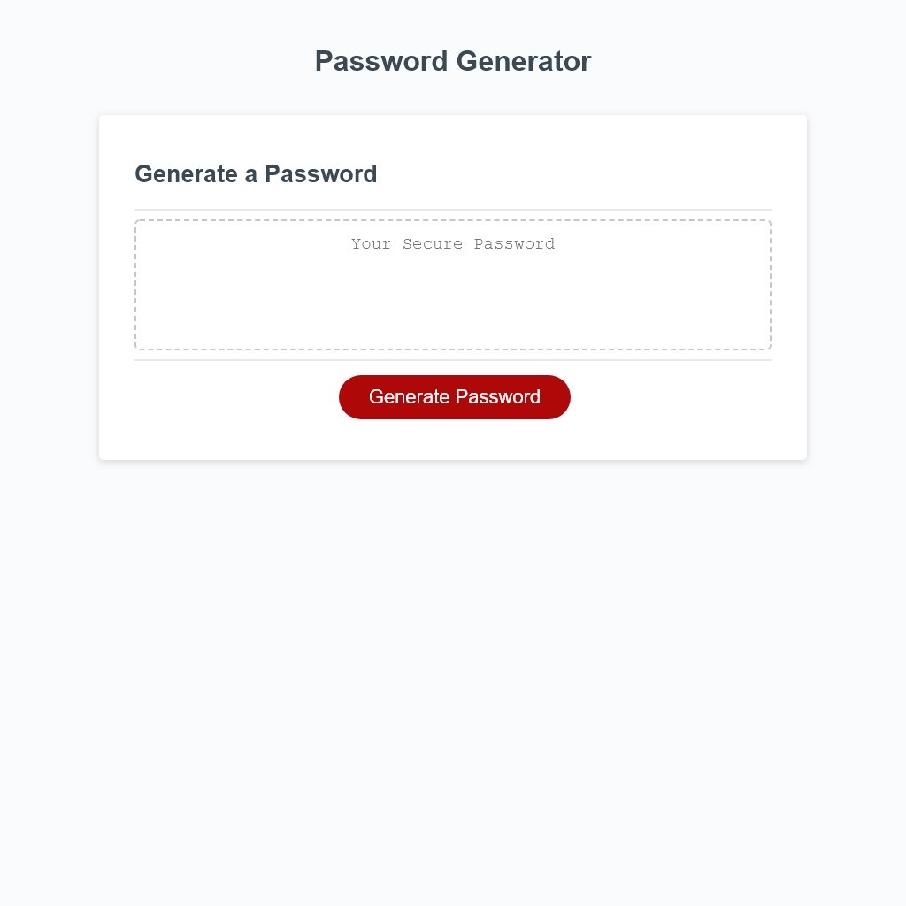

# ywk-password-generator

## Description
This web app is designed to generates randomized password for employees. Based on the employee's need and the password requirement, the applicatio is able to generate between 8-128 character password with selection of upper/lower case letter, numerics and special characters.

## Screenshot of the Application

## Features
- The application generates 8-128 character password.
- Ability to select whether to include upper/lower case, numeric and special character into the password generation. (Must select one.)
- Logics are build-in to validate user input to prevent incorrect user input, such as input other than Y/N or not a number in the password length question.
- If user clicked Cancel, a Confirm will ask if the user wish to quit the password generation before terminating or turning user back to the previous question. 
- If user click Cancel in the Confirmation to cancel the password generation will result in default being set. (No to all character type. 8 characters long.)